# Persistent Bottom Navigation Bar Version 2

[](https://github.com/jb3rndt/PersistentBottomNavBarV2/actions)
[](https://app.codecov.io/gh/jb3rndt/PersistentBottomNavBarV2/)
[](https://pub.dev/packages/persistent_bottom_nav_bar_v2)
[](https://github.com/jb3rndt/PersistentBottomNavBarV2/blob/master/LICENSE)
[](https://gitHub.com/jb3rndt/PersistentBottomNavBarV2/issues/)
[](https://gitHub.com/jb3rndt/PersistentBottomNavBarV2/stargazers/)

A highly customizable bottom navigation bar for Flutter. It is shipped with 17 prebuilt styles you can choose from (see below), but can also be used with your very own style without sacrificing any features. [View on `pub.dev`](https://pub.dev/packages/persistent_bottom_nav_bar_v2)

NOTE: This package is a continuation of [persistent_bottom_nav_bar](https://pub.dev/packages/persistent_bottom_nav_bar).

> [!IMPORTANT]
> If you are migrating from Version 4.x.x to Version 5 read this [MIGRATION GUIDE](https://github.com/jb3rndt/PersistentBottomNavBarV2/blob/master/MigrationGuide.md).

<p align="center">

</p>

<details>
  <summary><span style="font-size: 25px">Table of Contents</span></summary>

- [Styles](#styles)
- [Features](#features)
- [Getting Started](#getting-started)
  - [1. Install the package](#1-install-the-package)
  - [2. Import the package](#2-import-the-package)
  - [3. Use the `PersistentTabView`](#3-use-the-persistenttabview)
- [Styling](#styling)
- [Using a custom Navigation Bar](#using-a-custom-navigation-bar)
- [Controlling the Navigation Bar programmatically](#controlling-the-navigation-bar-programmatically)
- [Custom transition animation when switching pages](#custom-transition-animation-when-switching-pages)
- [Navigation](#navigation)
  - [Router API](#router-api)
- [Useful Tips](#useful-tips)

</details>

## Styles

| Style1                     | Style2                     | Style3                     |
| -------------------------- | -------------------------- | -------------------------- |
| 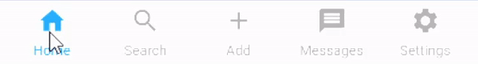 | 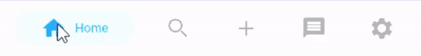 | 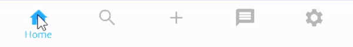 |

| Style4                     | Style5                     | Style6                     |
| -------------------------- | -------------------------- | -------------------------- |
| 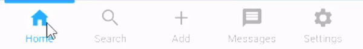 | 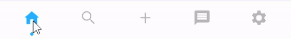 | 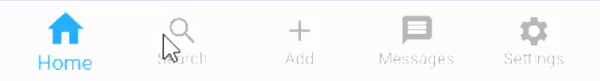 |

| Style7                     | Style8                     | Style9                     |
| -------------------------- | -------------------------- | -------------------------- |
| 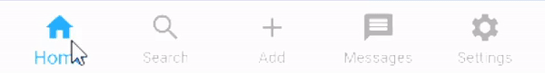 | 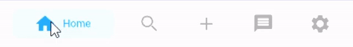 | 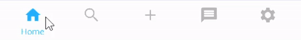 |

| Style10                      | Style11                      | Style12                      |
| ---------------------------- | ---------------------------- | ---------------------------- |
| 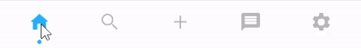 | 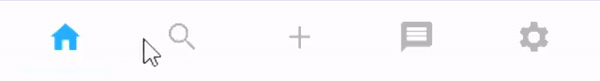 | 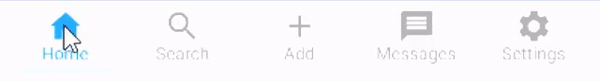 |

| Style13                      | Style14                      | Style15                      |
| ---------------------------- | ---------------------------- | ---------------------------- |
| 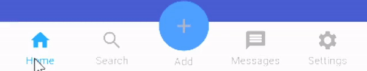 | 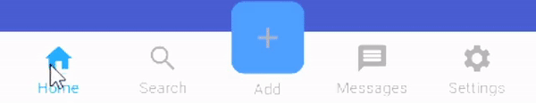 | 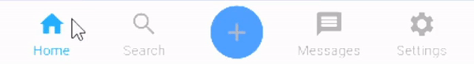 |

| Style16                      | Neumorphic                         |
| ---------------------------- | ---------------------------------- |
| 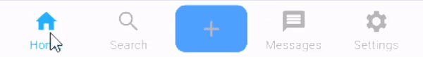 | 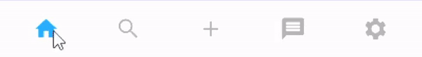 |

Note: These do not include all style variations

## Features

- New pages can be pushed with or without showing the navigation bar.
- 17 prebuilt navigation bar styles ready to use.
- Each style is fully customizable ([see below](#styling))
- Supports custom navigation bars
- Persistent Tabs -> Navigation Stack is not discarded when switching to another tab
- Supports transparency and blur effects
- Handles hardware/software Android back button.
- Supports [go_router](https://pub.dev/packages/go_router) to make use of flutters Router API

## Getting Started

### 1. Install the package

Follow the [install instructions](https://pub.dev/packages/persistent_bottom_nav_bar_v2/install).

### 2. Import the package

```dart
import 'package:persistent_bottom_nav_bar_v2/persistent_bottom_nav_bar_v2.dart';
```

### 3. Use the `PersistentTabView`

The `PersistentTabView` is your top level container that will hold both your navigation bar and all the pages (just like a `Scaffold`). Thats why it is not recommended, to wrap the `PersistentTabView` inside a `Scaffold.body`, because it does all of that for you. So just create the config for each tab and insert the `PersistentTabView` like this and you are good to go:

```dart
import 'package:flutter/material.dart';
import 'package:persistent_bottom_nav_bar_v2/persistent_bottom_nav_bar_v2.dart';

void main() => runApp(PersistenBottomNavBarDemo());

class PersistenBottomNavBarDemo extends StatelessWidget {
  @override
  Widget build(BuildContext context) {
    return MaterialApp(
      title: 'Persistent Bottom Navigation Bar Demo',
      home: PersistentTabView(
        tabs: [
          PersistentTabConfig(
            screen: YourFirstScreen(),
            item: ItemConfig(
              icon: Icon(Icons.home),
              title: "Home",
            ),
          ),
          PersistentTabConfig(
            screen: YourSecondScreen(),
            item: ItemConfig(
              icon: Icon(Icons.message),
              title: "Messages",
            ),
          ),
          PersistentTabConfig(
            screen: YourThirdScreen(),
            item: ItemConfig(
              icon: Icon(Icons.settings),
              title: "Settings",
            ),
          ),
        ],
        navBarBuilder: (navBarConfig) => Style1BottomNavBar(
          navBarConfig: navBarConfig,
        ),
      ),
    );
  }
}
```

## Styling

You can customize the Navigation Bar with all the parameters, each style allows. Every style allows you to pass an instance of `NavBarDecoration`. This inherits from `BoxDecoration` and thus offers everything the `BoxDecoration` is capable of. As an example, you could set a different border radius by passing `BorderRadius.circular(8)` to the `NavBarDecoration.border`. Styles that include animations also allow you to adjust the timings and interpolation curves of the animation.

## Using a custom Navigation Bar

You can replace the `Style1BottomNavBar` widget with your own custom widget. As you can see, the `navBarBuilder` gives you a `navBarConfig`, which should be everything you need to build your custom navigation bar. Here is an example of a custom navigation bar widget:

```dart
class CustomNavBar extends StatelessWidget {
  final NavBarConfig navBarConfig;
  final NavBarDecoration navBarDecoration;

  const CustomNavBar({
    super.key,
    required this.navBarConfig,
    this.navBarDecoration = const NavBarDecoration(),
  });

  Widget _buildItem(ItemConfig item, bool isSelected) {
    final title = item.title;
    return Column(
      mainAxisAlignment: MainAxisAlignment.center,
      children: [
        Expanded(
          child: IconTheme(
            data: IconThemeData(
              size: item.iconSize,
              color: isSelected
                      ? item.activeForegroundColor
                      : item.inactiveForegroundColor,
            ),
            child: isSelected ? item.icon : item.inactiveIcon,
          ),
        ),
        if (title != null)
          Padding(
            padding: const EdgeInsets.only(top: 15.0),
            child: Material(
              type: MaterialType.transparency,
              child: FittedBox(
                child: Text(
                  title,
                  style: item.textStyle.apply(
                    color: isSelected
                            ? item.activeForegroundColor
                            : item.inactiveForegroundColor,
                  ),
                ),
              ),
            ),
          ),
      ],
    );
  }

  @override
  Widget build(BuildContext context) {
    return DecoratedNavBar(
      decoration: navBarDecoration,
      height: navBarConfig.navBarHeight,
      child: Row(
        mainAxisAlignment: MainAxisAlignment.spaceAround,
        crossAxisAlignment: CrossAxisAlignment.center,
        children: [
          for (final (index, item) in navBarConfig.items.indexed)
            Expanded(
              child: InkWell(
                // This is the most important part. Without this, nothing would happen if you tap on an item.
                onTap: () => navBarConfig.onItemSelected(index),
                child: _buildItem(item, navBarConfig.selectedIndex == index),
              ),
            ),
        ],
      ),
    );
  }
}
```

In your `PersistentTabView`, you can use it just like the predefined style:

```dart
PersistentTabView(
  tabs: ...,
  navBarBuilder: (navBarConfig) => CustomNavBar(
    navBarConfig: navBarConfig,
  ),
),
```

The most important thing is that you call the `navBarConfig.onItemSelected` function with the index of the tapped item, otherwise the `PersistentTabView` will not react to anything.

You dont need to use either the `DecoratedNavBar` widget, nor the `NavBarDecoration`, it is just a helper for you. You can do whatever you want in that custom navigation bar widget, as long as you remember to invoke the `onItemSelected` callback.

## Controlling the Navigation Bar programmatically

Internally, the `PersistentTabView` uses a `PersistentTabController`. So you can pass a controller to the `PersistentTabView` to use it later for changing the tab programmatically:

```dart
PersistentTabController _controller = PersistentTabController(initialIndex: 0);

PersistentTabView(
  controller: _controller,
  ...
);

_controller.jumpToTab(2);

// Navigate to the previously selected Table
_controller.jumpToPreviousTab();

```

## Custom transition animation when switching pages

When switching from one tab to another, the default behavior is a slide transition that slides the current page to the left or right and reveals the taget page by sliding it into the screen. You can customize this behavior by building your own animation, e.g. by fading out the current page and fading in the new one. To control the animation, you can pass a function to `PersistentTabView.animatedTabBuilder`. This function is a builder that builds the old page and the new page at the same time. That is why it gets the BuildContext as an argument, the index of the currently built tab, the progress of the animation, the new index, the old index and the actual page content as a child.

This is what the default animation builder looks like:

```dart
 final double yOffset = newIndex > index
     ? -animationValue
     : (newIndex < index
         ? animationValue
         : (index < oldIndex ? animationValue - 1 : 1 - animationValue));
 return FractionalTranslation(
   translation: Offset(yOffset, 0),
   child: child,
 );
```

## Navigation

Each of your Tabs will get its own Navigator, so they dont interfere with eachother. That means there will now be a difference between calling `Navigator.of(context).push()` (which will push a new screen inside the current tab) and `Navigator.of(context, rootNavigator: true).push()` (which will push a new screen above the whole `PersistentTabView`, ultimately hiding your navigation bar).

The package includes the following utility functions for expressive navigation.

```dart
pushScreen(
  context,
  screen: MainScreen(),
  withNavBar: true/false,
);
```

```dart
pushWithNavBar(
  context,
  MaterialPageRoute(builder: (context) => ...)
);
```

```dart
pushWithoutNavBar(
  context,
  MaterialPageRoute(builder: (context) => ...)
);
```

By default, each of the tabs navigators will inherit all the settings of the root navigator. So every configuration you do to the named routes (etc.) of the root navigator, will work just the same in each tab. If you want specific settings for each navigator (like additional routes, `NavigatorObservers` etc.), you can do so by passing a `NavigatorConfig` to the respective `PersistentTabConfig`.

The `PersistentTabView` has the ability to remember the navigation stack for each tab, so when you switch back to it you will see the exact same content when you left. This behavior can be toggled with the `PersistentTabView.stateManagement` parameter.

### Router API

To utilize flutters Router API for navigation in combination with this package, [go_router](https://pub.dev/packages/go_router) must be used. Follow the setup in the [go_router](https://pub.dev/packages/go_router) documentation to get started with declarative routing. To integrate your Persistent Navigation Bar, you have to setup a `StatefulShellRoute.indexedStack` as one of your routes, which will contain the `PersistentTabView`. See the [example](https://github.com/jb3rndt/PersistentBottomNavBarV2/blob/master/example/lib/go_router_example.dart) for a full code example or the code snippet below:

- use `PersistentTabView.router` instead of `PersistentTabView`
- pass the `navigationShell` to the `PersistentTabView.router` (this will contain each tab view)
- use `PersistentRouterTabConfig` instead of `PersistentTabConfig`  (notice the missing `screen` argument because the screens are specified by the routes in each `StatefulShellBranch`)

```dart
StatefulShellRoute.indexedStack(
  builder: (context, state, navigationShell) =>
      PersistentTabView.router(
    tabs: [
      PersistentRouterTabConfig(
        item: ItemConfig(
          icon: const Icon(Icons.home),
          title: "Home",
        ),
      ),
      PersistentRouterTabConfig(
        item: ItemConfig(
          icon: const Icon(Icons.message),
          title: "Messages",
        ),
      ),
      PersistentRouterTabConfig(
        item: ItemConfig(
          icon: const Icon(Icons.settings),
          title: "Settings",
        ),
      ),
    ],
    navBarBuilder: (navBarConfig) => Style1BottomNavBar(
      navBarConfig: navBarConfig,
    ),
    navigationShell: navigationShell,
  ),
  branches: [
    // The route branch for the 1st Tab
    StatefulShellBranch(
      routes: <RouteBase>[
        GoRoute(
          path: "home",
          builder: (context, state) => const MainScreen(
            useRouter: true,
          ),
          routes: [
            GoRoute(
              path: "detail",
              builder: (context, state) => const MainScreen2(
                useRouter: true,
              ),
            ),
          ],
        ),
      ],
    ),

    // The route branch for 2nd Tab
    StatefulShellBranch(
      routes: <RouteBase>[
        GoRoute(
          path: "messages",
          builder: (context, state) => const MainScreen(
            useRouter: true,
          ),
        ),
      ],
    ),

    // The route branch for 3rd Tab
    StatefulShellBranch(
      routes: <RouteBase>[
        GoRoute(
          path: "settings",
          builder: (context, state) => const MainScreen(
            useRouter: true,
          ),
        ),
      ],
    ),
  ],
),
```

## Useful Tips

- Try the [interactive example project](https://github.com/jb3rndt/PersistentBottomNavBarV2/tree/master/example) in the official git repo to get a better feeling for the package

- Pop to any screen in the navigation graph for a given tab:

    ```dart
    Navigator.of(context).popUntil((route) {
        return route.settings.name == "ScreenToPopBackTo";
    });
    ```

- Pop back to first screen in the navigation graph for a given tab:

    ```dart
    Navigator.of(context).popUntil(ModalRoute.withName("/"));
    ```

    In order for this to work, you will need your `PersistentNavBarItem` to be named '/' like:

    ```dart
      PersistentBottomNavBarItem(
          title: ("Home"),
          routeAndNavigatorSettings:
              RouteAndNavigatorSettings(initialRoute: '/')),
    ```

    Or instead of using a named Route you can also do this:

    ```dart
    Navigator.of(context).pushAndRemoveUntil(
        CupertinoPageRoute(
        builder: (BuildContext context) {
            return FirstScreen();
        },
        ),
        (_) => false,
    );
    ```

- To push bottom sheet on top of the Navigation Bar, use showModalBottomScreen and set it's property `useRootNavigator` to true. See example project for an illustration.

- If you need e.g. notification counters on the icons in the navBar, you can use the [badges package](https://pub.dev/packages/badges) like so: (see [Issue 11](https://github.com/jb3rndt/PersistentBottomNavBarV2/issues/11))

    ```dart
    PersistentTabConfig(
        screen: ...,
        item: ItemConfig(
            icon: Badge(
                animationType: BadgeAnimationType.scale,
                badgeContent: UnreadIndicator(),
                child: const Icon(
                    Icons.chat_rounded,
                ),
            ),
            title: "Chat",
        ),
    ),
    ```
